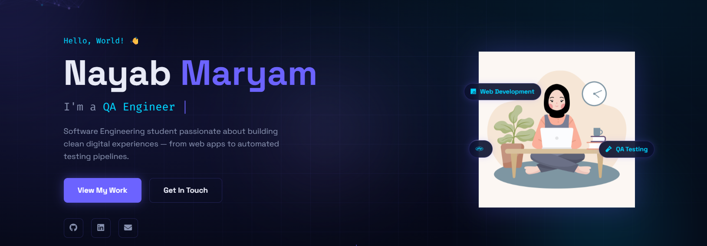
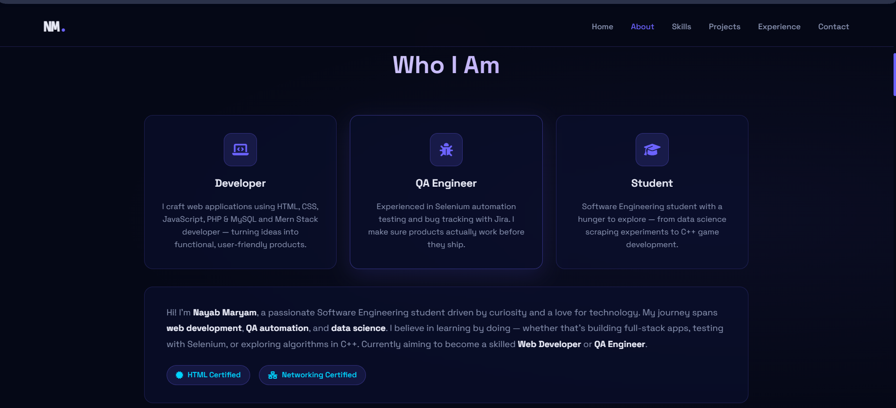
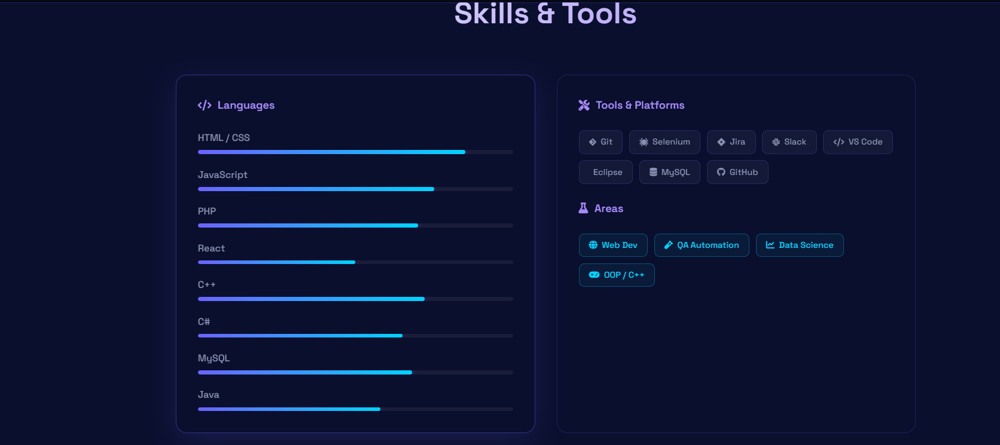
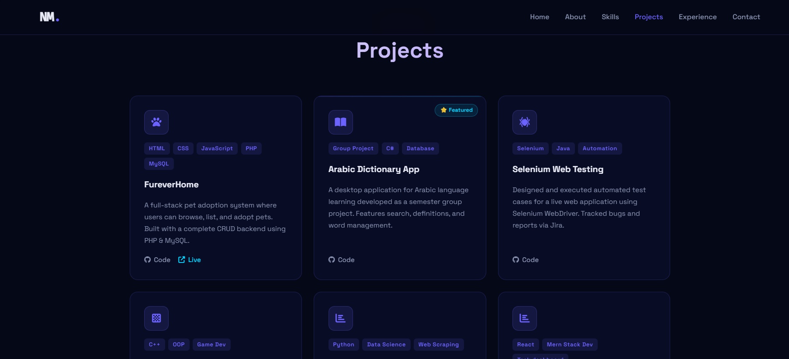
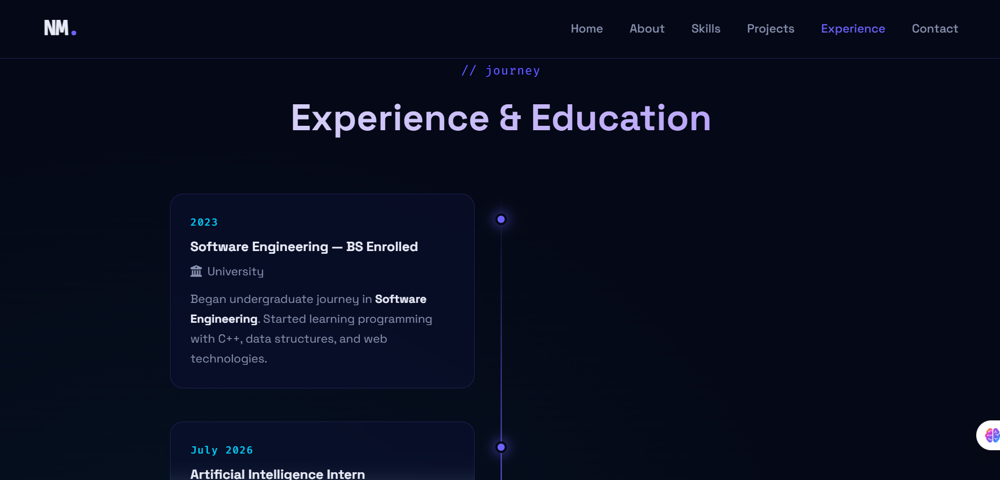
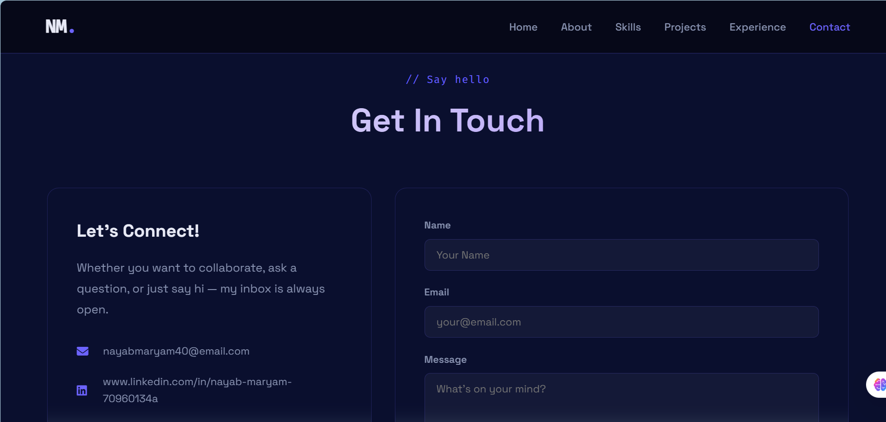
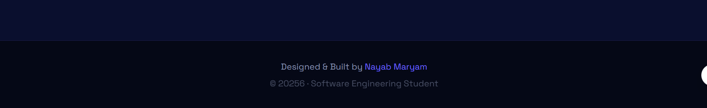
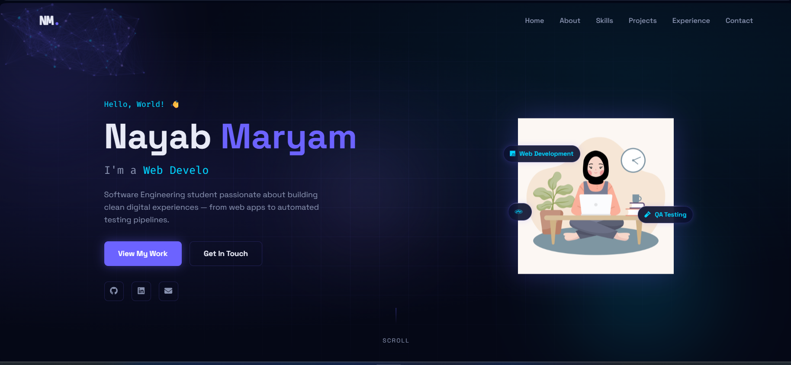
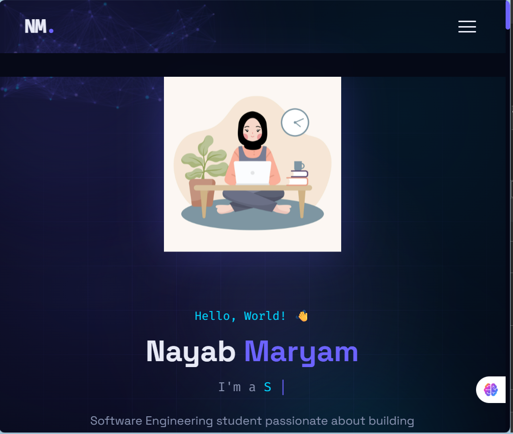

# 🌐 Animated Personal Portfolio Website


---

## 📌 Project Title

**Animated Personal Portfolio Website**

---

## 📝 Project Description

A fully responsive, animated personal portfolio website built from scratch using HTML, CSS, and JavaScript. The website is designed to showcase the skills, projects, certifications, and experience of **Nayab Maryam**, a Software Engineering student aspiring to become a Web Developer or QA Engineer.

The portfolio features a dark navy theme with neon purple and cyan accents, smooth scroll animations, a typing role effect, an interactive particle background, animated skill bars, a project showcase grid, an alternating experience timeline, and a contact form — all without any external frameworks or libraries beyond Font Awesome icons and Google Fonts.

---

## 🛠️ Technologies Used

| Technology | Purpose |
|---|---|
| HTML5 | Page structure and semantic markup |
| CSS3 | Styling, animations, flexbox, grid, responsive design |
| JavaScript (ES6) | Typing effect, particles, scroll reveal, form handling |
| PHP | Contact form backend processing |
| MySQL | Database layer (used in referenced projects) |
| Google Fonts | Space Grotesk + Fira Code typography |
| Font Awesome 6 | Icon library for UI elements |
| Git / GitHub | Version control and repository hosting |
| VS Code | Code editor used for development |
| Live Server | VS Code extension for real-time browser preview |

---

## ✨ Website Features

- **Typing Animation** — Cycles through roles: Web Developer, QA Engineer, Software Engineer, Problem Solver
- **Particle Background** — Interactive animated particle network on the hero section built with HTML5 Canvas API
- **Scroll Reveal Effects** — Sections fade and slide into view as the user scrolls using IntersectionObserver
- **Animated Skill Bars** — Progress bars fill to their percentage values when scrolled into view
- **Animated SVG Character** — A custom hijabi girl character that floats, blinks, and types on a laptop
- **Project Cards** — Five project cards with hover lift effect, tech tags, and GitHub links
- **Experience Timeline** — Alternating vertical timeline for education and project history
- **Glassmorphism Cards** — Frosted glass card effect using CSS `backdrop-filter`
- **Contact Form** — HTML form with JavaScript validation and success state animation
- **Active Nav Highlighting** — Navigation link highlights based on current scroll position
- **Mobile Hamburger Menu** — Animated open/close hamburger for mobile navigation
- **Fully Responsive** — Tested at desktop (1200px+), tablet (768–1024px), and mobile (< 768px)
- **Accessibility** — `prefers-reduced-motion` media query disables all animations when enabled
- **Custom Scrollbar** — Styled scrollbar matching the dark theme

---

## 📁 Project Structure

```
portfolio/
│
├── index.html               # Main HTML file — all sections in one page
│
├── css/
│   ├── style.css            # All layout, components, and responsive styles
│   └── animations.css       # Keyframe animations and scroll-reveal classes
│
├── js/
│   └── main.js              # Typing effect, particles, scroll reveal, form handler
│
├── assets/                  # Static files folder
│   └── girl.jpg             # (Optional) Downloadable CV/Resume
│
└── README.md                # Project documentation (this file)
```

### Sections inside `index.html`

```
1. <nav>        — Fixed navigation bar with logo and smooth scroll links
2. #hero        — Hero section with character, typing text, and particle background
3. #about       — About cards (Developer / QA Engineer / Student) + biography
4. #skills      — Animated skill progress bars and tool tag pills
5. #projects    — Five project cards in a responsive CSS Grid
6. #experience  — Alternating vertical timeline of education and projects
7. #contact     — Contact info card and HTML contact form
8. <footer>     — Name, copyright line
```

---

## 📸 Screenshots

> Replace the placeholder text below with your actual screenshots after running the project.

### Hero / Home Section




### About Section




### Skills Section




### Projects Section




### Experience / Education Section



### Contact Section




### Footer




### Desktop View




### Mobile View




---

## ▶️ Instructions for Running the Website

### Option 1 — Open Directly in Browser (Quickest)

1. Download or clone this repository:
   ```bash
   git clone https://github.com/MindfullLearner/portfolio.git
   ```
2. Open the project folder.
3. Double-click `index.html` to open it in your default browser.

> ⚠️ Note: The contact form requires a server to run PHP. For the static front-end only, this method works perfectly.

---

### Option 2 — Using VS Code Live Server (Recommended for Development)

1. Open the project folder in **VS Code**.
2. Install the **Live Server** extension (by Ritwick Dey) from the Extensions panel.
3. Right-click `index.html` in the file explorer.
4. Select **"Open with Live Server"**.
5. The website will open automatically at `http://127.0.0.1:5500`

---

### Option 3 — Deploy on GitHub Pages (Free Hosting)

1. Push the project to a GitHub repository.
2. Go to **Settings → Pages** in your repository.
3. Under **Source**, select the `main` branch and `/ (root)` folder.
4. Click **Save**.
5. Your portfolio will be live at:
   ```
   https://portfolio-sand-iota-70.vercel.app/
   ```

---

### Option 4 — Run with a Local PHP Server (for Contact Form)

1. Install [XAMPP](https://www.apachefriends.org/) or [WAMP](https://www.wampserver.com/).
2. Place the `portfolio/` folder inside the `htdocs/` directory (XAMPP) or `www/` (WAMP).
3. Start Apache from the control panel.
4. Open your browser and go to:
   ```
   http://localhost/portfolio/
   ```

---

## 🔗 GitHub Repository

```
https://github.com/MindfullLearner/portfolio
```

> **Note:** Update this link with your actual GitHub repository URL before submitting.

---

## 👩‍💻 Author

**Nayab Maryam**
Software Engineering Student

---
